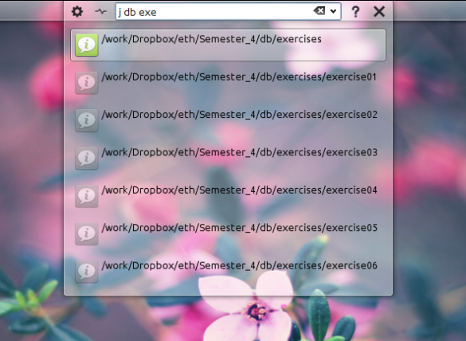

NAME
----

krunner_autojump_plugin - integrate autojump into KDE's krunner 

USAGE
-----
The plugin works just like autojump in the command line.

Jump to directory in Konsole

    j foo

Jump to directory in Dolphin
	jo foo

INSTALLATION
------------

The plugin requires a working [autojump](http://github.com/joelthelion/autojump) installation, and of course the KDE desktop environment.

To install just run:
	./install.sh

To remove just run:
	./remove.sh

COPYRIGHT
---------

Copyright © 2013 Free Software Foundation, Inc. License GPLv3+: GNU GPL
version 3 or later <http://gnu.org/licenses/gpl.html>. This is free
software: you are free to change and redistribute it. There is NO
WARRANTY, to the extent permitted by law.
